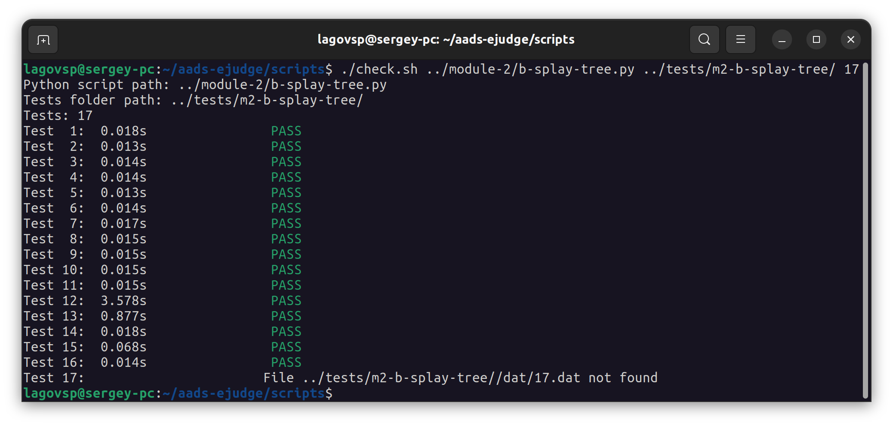

# АиСД МГТУ ИУ8 Осень 2022 (Ejudge)

## Отказ от ответственности

**Все, что в этом репозитории - истина в последней инстанции?**
Нет! Это просто полезные материалы, которые удалось собрать в течение семестра.
Некоторые утверждения могут оказаться устаревшими.
Тесты к задачам в следующем году могут дополниться, а задачи - полностью поменяться.
Представленный в репозитории тестировщик - лишь самописный инструмент, позволяющий автоматизировать
локальное тестирование решения, **не имеющий никакого отношения
к тому грейдеру, что будет проверять ваши решения на сервере**

**То есть я могу просто залить на сервер эти задачи и всё?**
Нет. На сервере ваше отправленное решение прогоняется как на
грейдере, так и на антиплагиате. Антиплагиат ищет совпадения со всеми когда-либо
проверенными им работами (в том числе и с данными), а также теми, что можно найти в интернете (скопировать реализацию
структуры с Хабра/англоязычного ресурса не получится).
**Списывать убедительно не рекомендуется - ваше решение
будет дисквалифицировано - вы получите штраф по баллам,
а преподаватель может выписать вам дизреспект и не поставить баллов за модуль вовсе!**
Настоятельно рекомендую сделать эти задачи самостоятельно и
смотреть на решения только в случае, если у вас серьезные затруднения

## Вопросы

**Зачем я всё это выложил?**
Чтобы предупредить следующие поколения о странностях тестов, ~~которые ни один человек не предугадает~~,
а также, чтобы у вас в крайнем случае всегда было куда подсмотреть
(в случае, если вы неделю сидите и не можете понять, как делать задание)

**Серёга, твой код - просто ужас!**
Пожалуй, не идеальный. Есть то, что можно было улучшить, но в круговороте дедлайнов
это сделать так и не удалось, или попросту не было времени. К тому же,
все представленные решения были приняты преподавателями. Да и у вас есть прекрасная
возможность половить лулзов с автокоррекции ~~пока не начнете писать её сами~~

**Почему почти все задачи написаны на Python?**
Потому что ~~я умею писать только на псевдокоде~~ он достаточно быстрый и хорошо
подходит для решения поставленных перед нами задач. Там, где необходимо работать с памятью
(Дек), хорошо подойдет C++. В остальных задачах это не требуется. Плюсовый код на Ejudge
(далее - ёж) тестируется под дикими санитайзерами (инструменты, отслеживающие утечки памяти),
что катастрофически его замедляет (не забываем, что решение должно проходить тесты как по памяти,
так и по времени). Сдать все таски на плюсах можно, а нужно ли? Время не резиновое.
Курс даётся не для того, чтобы научить тонкостям программирования.
Его цели - закрепить пройденный на занятиях материал, научить ~~вычислять сумму чисел~~ эффективно решать прикладные задачи,
определять сложности алгоритмов, оптимизировать их
и находить баланс между скоростью и памятью, а также обосновывать свой выбор

## Задачи

* **Модуль 1**
    * [Сумма (Python)](module-1/a-sum.py)
    * [Дек (C++)](module-1/b-dequeue.cpp)
    * [Зависимости (Python)](module-1/c-dependencies.py)

* **Модуль 2**
    * [Splay-дерево (Python)](module-2/b-splay-tree.py)
    * [Min-куча (Python)](module-2/c-min-heap.py)
    * [Автозамена (Python)](module-2/d-autocorrection.py)

* **Модуль 3**
    * Блок (Python)
    * Фильтр Блума (Python)
    * Рюкзак (Python)

## Тестирование

Для тестирования своих решений можно использовать `check.sh` из папки `scripts`.
Для этого скопируйте файлы `checker.py` и `check.sh` в одну директорию и введите команду
`./check.sh <solution.py> <tests-folder> <tests-number>`, где

- `<solution.py>` - название вашего скрипта на Python
  (или путь до него относительно `check.sh`, если скопированные файлы находятся в другой директории)
- `<tests-folder>` - путь до папки с тестами к вашему заданию.
  В этой папке должны находится папки `dat` и `ans` с вводом тестов
  и ответами к ним соответственно (см. пример в репозитории)
- `<tests-number>` - количество тестов. Будут прогоняться все тесты в диапазоне `[0;N]`
  (от `1.dat` до `N.dat`). Ничего страшного,
  если некоторых тестов из диапазона не будет, — они будут проигнорированы

**Все тесты нашего года лежат в папке tests**

__P.S.__: Надо сказать, что суть представленного проверяющего
скрипта - построчно сверить правильный вывод (один из правильных?) с выводом решения пользователя. Это следует учитывать.
К примеру, тесты к задаче C из 1 модуля не будут проходить практически всегда, так как по условию порядок вывода зависимостей не важен.
Грейдер на сервере это учитывает и просто следит за тем, что бы все нужные зависимости присутствовали и никаких других не было.
Также, судя по всему, сервер может принять как ответ с символом новой строки `'\n'` в последней строке, так и без него
(не на всех задачах (помнится, эта проблема была в 1 модуле). Сделано это для того, чтобы выбор языка меньше влиял на решение сервера).
Тесты в репозитории "адаптированы" под вывод Python

**Если возникают вопросы касательно условия задачи и формата вывода - спрашивайте преподавателя**

**Если вылезает ошибка количества строк при локальном тестировании - попробуйте добавить/убрать пустую строку в конце файла `.ans` и попробовать
запустить проверку заново**

## Система оценивания

На осень 2022 года актуальны следующие правила оценивания модулей на еже

- За модуль можно получить **максимум 20 баллов**
- За полностью сданный и принятый преподавателем модуль можно получить **минимум 5 баллов**
- За **каждый реждект** (отклонение) работы вы теряете **2 балла**
- За сдачу модуля **после обозначенного дедлайна** вы теряете **5 баллов** (просроченный модуль - если хоть 1 задача не сдана к моменту основного
  ревью)
- Если вы потратили на задачу **от 4 до 7 попыток** включительно, вы теряете **2 балла**
- Если вы потратили на задачу **8 и более попыток**, вы теряете **4 балла**
- За **списывание** задачи вы теряете **3 балла**
- За **повторное списывание** баллы за модуль **начислены не будут** (даже если потом вы его полностью сделаете сами от и до)

###### Автор: Сергей Лагов ИУ8-52

###### Внесли вклад: Андрей Николаев, Иван Алферов, Богдан Шумилишский
