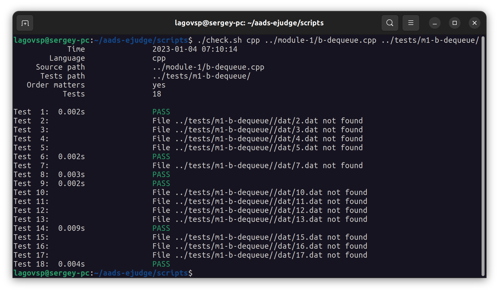
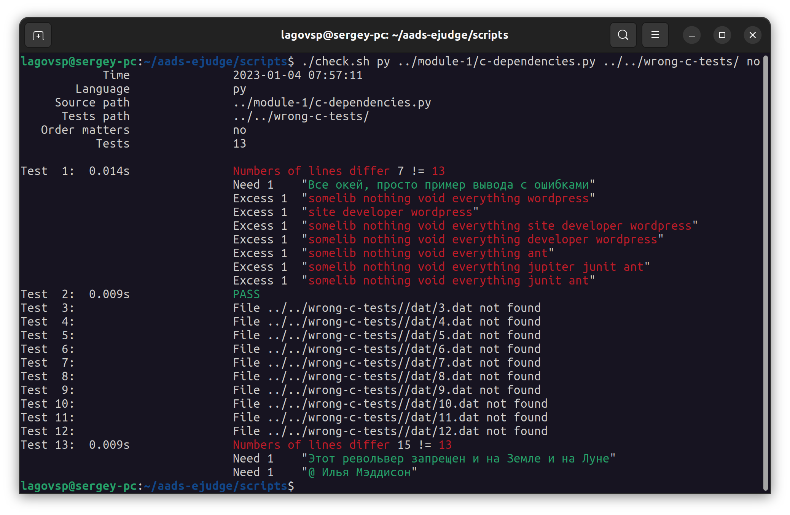
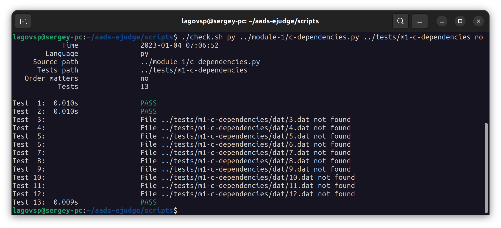
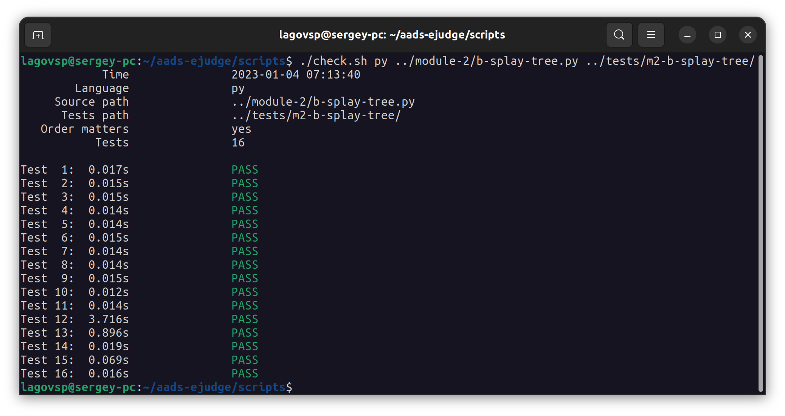

# Ejudge (АиСД) — МГТУ ИУ8 2022

## Задачи

* **Модуль 1**
    * [Сумма (Python)](module-1/a-sum.py)
    * [Дек (C++)](module-1/b-dequeue.cpp)
    * [Зависимости (Python)](module-1/c-dependencies.py)

* **Модуль 2**
    * [Splay-дерево (Python)](module-2/b-splay-tree.py)
    * [Min-куча (Python)](module-2/c-min-heap.py)
    * [Автокоррекция (Python)](module-2/d-autocorrection.py)

* **Модуль 3**
    * [Блок (Python)](module-3/a-block.py)
    * [Фильтр Блума (Python)](module-3/b-bloom.py)
    * [Рюкзак (Python)](module-3/c-knapsack.py)

## Тестирование для Python и C++ (Ubuntu 22.04.1 LTS)

Из папки `scripts` запустите команду
`./check.sh <language-name> <source-code> <tests-folder> [check-mode]`, где

- `<language-name>` — язык решения (`py`/`cpp`)
- `<source-code>` — путь до файла с исходным кодом
- `<tests-folder>` — путь до папки с тестами к заданию.
  В этой папке должны находиться папки `dat` и `ans` с вводом тестов
  и ответами к ним соответственно (см. пример в репозитории)
- `[check-mode]` — *опционально* — режим проверки ответов программы.
  `no` — порядок строк в ответе не будет значим **(специально для задачи C 1 модуля)**
  — по умолчанию порядок играет роль.
  
  

