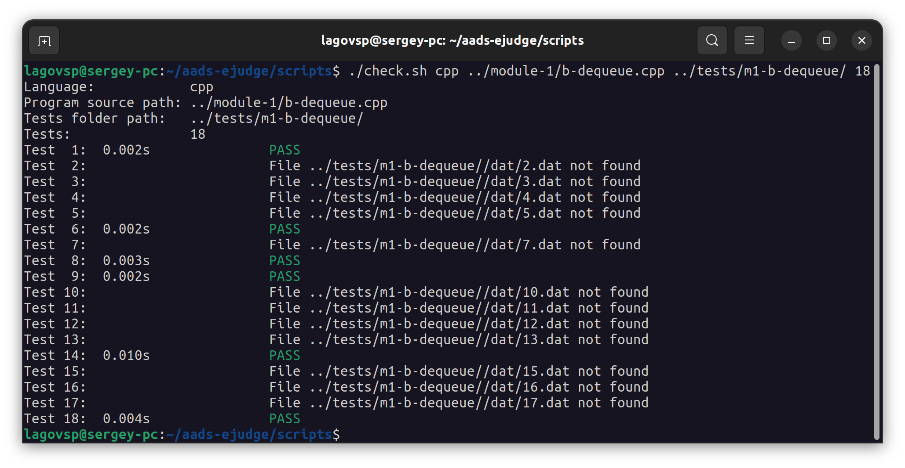
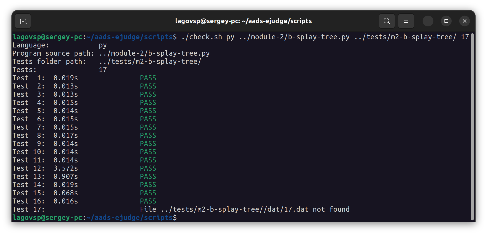

# Ejudge (АиСД) — МГТУ ИУ8 2022

## Отказ от ответственности

**Содержимое репозитории — истина в последней инстанции?**
Нет! Это просто полезные материалы: решения принятых задач, тесты,
скрипт для тестирования.
Некоторые утверждения могут оказаться устаревшими:
тесты могут дополниться, а задачи — полностью поменяться.
Представленный тестировщик —
самописный инструмент для автоматизации локального тестирования.
**Он не имеет никакого отношения к тому грейдеру,
что будет проверять ваши решения на сервере**

**То есть я могу просто залить на сервер эти задачи и всё?**
Нет. На сервере ваши посылки прогоняются на грейдере и антиплагиате.
Антиплагиат ищет совпадения со всеми когда-либо проверенными им работами
(в том числе и с данными), а также теми, что можно найти в интернете
(скопировать код с Хабра/англоязычного ресурса не получится).
**Списывать не рекомендуется — решение будет дисквалифицировано,
вы получите штраф по баллам,
а преподаватель может выписать вам дизреспект
и не поставить баллов за модуль вовсе.**
Настоятельно рекомендуется выполнять задания самостоятельно и
смотреть на решения только если у вас серьезные затруднения

## Вопросы

**Зачем я всё это выложил?**
Чтобы предупредить следующие поколения о странностях тестов,
~~которые ни один человек не предугадает,~~
а также, чтобы у вас в крайнем случае всегда было куда подсмотреть
(если вы неделю сидите и не можете понять, как делать задание)

**Код — просто ужас!**
Не идеальный. Есть то, что можно улучшить, но в круговороте дедлайнов сделать это так и не удалось.
Зато у вас есть прекрасная возможность половить лулзов с автокоррекции ~~пока не начнете писать её сами.~~
Все представленные решения были приняты преподавателями

**Почему почти все задачи на Python?**
Потому что ~~я умею писать только на псевдокоде~~ он достаточно быстрый и хорошо
подходит для решения поставленных задач.
Плюсовый код на Ejudge (далее — ёж) тестируется с valgrind,
что катастрофически его замедляет (решение должно проходить тесты как по памяти, так и по времени).
Курс даётся не для того, чтобы научить тонкостям программирования (предполагается, что прогать все +- умеют).
Его цель — закрепить пройденный материал, научить ~~вычислять сумму чисел~~
эффективно решать прикладные задачи, определять сложности алгоритмов, оптимизировать их
и находить баланс между скоростью и памятью

## Инкапсуляция

В большинстве задач 2 и 3 модуля при реализации СД требуется её инкапсулировать.
Несоблюдение инкапсуляции повлечет за собой реджект задания и потерю минимум 2 баллов

**Что означает инкапсуляция?**
Реализация алгоритма таким образом,
чтобы его внутренняя логика не зависела от формата входных и выходных данных.
Ошибкой будет, если:

- **методы структуры что-то печатают**

  Оформление вывода осуществляется в мейне.
  Все взаимодействия с объектом происходят посредством вызова его методов
  (хотя в Python допускается чтение полей)

- **методы структуры возвращают чрезмерное количество значений**

  Возвращение значений,
  "заточенных" под требуемый в конкретной задаче формат вывода, — нарушение инкапсуляции
  > Пример. Метод max() —> (key, index, value)  у min-кучи явно
  > написан с оглядкой на условие задачи

Сначала подумайте, какие у класса должны быть методы и
какие у них должны быть сигнатуры, а только затем смотрите, в каком
формате вам необходимо реализовать вывод в мейне.
**Самой СД должно быть без разницы, что и в каком формате от вас требуют в выводе**

## Задачи

* **Модуль 1**
    * [Сумма (Python)](module-1/a-sum.py)
    * [Дек (C++)](module-1/b-dequeue.cpp)
    * [Зависимости (Python)](module-1/c-dependencies.py)

* **Модуль 2**
    * [Splay-дерево (Python)](module-2/b-splay-tree.py)
    * [Min-куча (Python)](module-2/c-min-heap.py)
    * [Автокоррекция (Python)](module-2/d-autocorrection.py)

* **Модуль 3**
    * Блок (Python)
    * Фильтр Блума (Python)
    * Рюкзак (Python)

## Тестирование для Python и C++

**Все доступные нам тесты
(были также и те, ввод которых был недоступен)
2022 года лежат в папке tests**

Для тестирования своих решений можно использовать `check.sh` из папки `scripts`.
Для этого скопируйте файлы `checker.py` и `check.sh` в одну директорию и введите команду
`./check.sh <language-name> <source-code> <tests-folder> <tests-number>`, где

- `<language-name>` — название языка. `py` — Python, `cpp` — C++
- `<source-code>` — путь до файла с исходным кодом
- `<tests-folder>` — путь до папки с тестами к вашему заданию.
  В этой папке должны находиться папки `dat` и `ans` с вводом тестов
  и ответами к ним соответственно (см. пример в репозитории)
- `<tests-number>` — количество тестов.
  Будут прогоняться все тесты в диапазоне `[0;N]` (от `1.dat` до `N.dat`).
  Ничего страшного, если некоторых тестов из диапазона не будет, — они будут проигнорированы

**P.S.:**
Суть скрипта — **построчно сверить правильный вывод с выводом решения пользователя**.
Это важно понимать. К примеру, даже при корректном выполнении
**тесты к задаче C из 1 модуля не будут проходить практически всегда**,
так как порядок вывода зависимостей не важен.
Грейдер на сервере это учитывает и следит за тем,
что бы все нужные зависимости присутствовали и никаких других не было.
Также, судя по всему (?), сервер может принять как ответ с символом новой строки `\n` в
последней строке, так и без него (не на всех задачах).
Представленные задачи успешно проходят локальное тестирование
на представленных тестах в том виде, в котором они были загружены на ежа и одобрены судьями

**Если возникают любые вопросы касательно условия задачи и формата вывода — всегда лучше
спросить преподавателя**

**Если вылетает ошибка количества строк при локальном тестировании — попробуйте добавить/убрать
пустую строку в конце файла `.ans` и попробовать запустить проверку заново**

## Система оценивания

На осень 2022 года актуальны следующие правила оценивания модулей на еже:

- За модуль можно получить **максимум 20 баллов**
- За полностью сданный и принятый преподавателем модуль можно получить **минимум 5 баллов**
- За **каждый реждект** работы вы теряете **2 балла**
- За сдачу модуля **после обозначенного дедлайна** вы теряете **5 баллов**
  (просроченный модуль - если хоть 1 задача не сдана к моменту основного ревью)
- Если вы потратили на задачу **от 4 до 7 попыток** включительно, вы теряете **2 балла**
- Если вы потратили на задачу **8 и более попыток**, вы теряете **4 балла**
- За **списывание** задачи вы теряете **3 балла**
- За **повторное списывание** баллы за модуль **начислены не будут**
  (даже если потом вы его полностью сделаете сами)
- Если вы захотели зарефакторить своё решение и отправить повторно посылку при статусе **Ожидает проверки**:
    * и ваш код **прошел все тесты** — счетчик попыток **не увеличится**,
      а предыдующее пройденное решение будет **проигнорировано**.
      Проверяться будет всегда крайнее решение, которое прошло все тесты
    * а ваш код **упал на тестах** — задание останется сданным по прошлой посылке,
      но **счётчик попыток увеличится**, что может сказаться на ваших баллах за модуль
